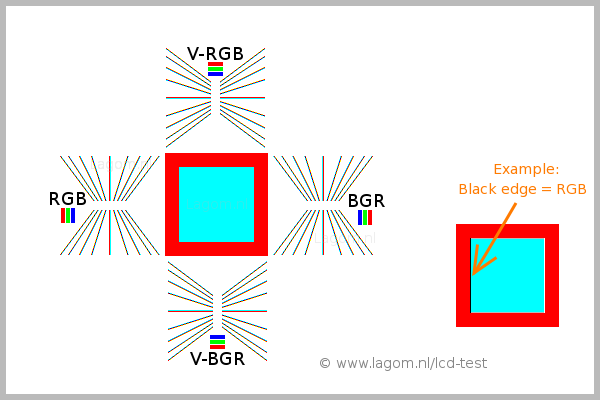

# Install
```
sudo pacman -Sy freetype2 ttf-dejavu ttf-liberation noto-fonts adobe-source-code-pro-fonts adobe-source-sans-fonts adobe-source-serif-fonts adobe-source-han-sans-otc-fonts adobe-source-han-serif-otc-fonts ttf-hanazono otf-font-awesome

yay -S ttf-ms-win11-auto
```

# Configure TrueType:

Do test below to select correct `10-sub-pixel-*.conf`:


```bash
mkdir $XDG_CONFIG_HOME/fontconfig/conf.d

ln -s /usr/share/fontconfig/conf.avail/70-no-bitmaps.conf $XDG_CONFIG_HOME/fontconfig/conf.d
ln -s /usr/share/fontconfig/conf.avail/10-sub-pixel-rgb.conf $XDG_CONFIG_HOME/fontconfig/conf.d
ln -s /usr/share/fontconfig/conf.avail/11-lcdfilter-default.conf $XDG_CONFIG_HOME/fontconfig/conf.d
```

Uncomment/add in `/etc/profile.d/freetype2.sh`:
```
export FREETYPE_PROPERTIES="truetype:interpreter-version=40"
```

# See for more:
https://gist.github.com/YoEight/d19112db56cd8f93835bf2d009d617f7
https://wiki.archlinux.org/title/Fonts
https://wiki.archlinux.org/title/Font_configuration
